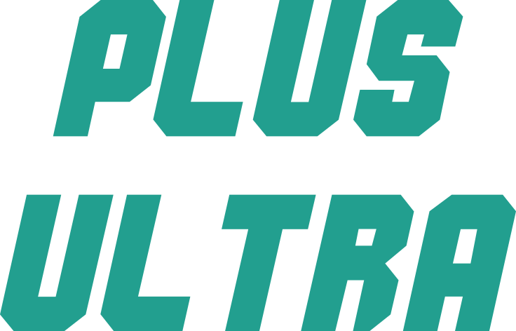

# Oi, eu sou a Bea 🦔

Adoro Python e Programação Funcional. Atualmente estou estudando frontend e desenvolvendo uns jogos bem legais com JavaScript :D

O projeto da vez é um endless runner que começou na semana de imersão da Alura: [As aventuras de Erin]. Estou trabalhando com código e a Carolina, uma ilustradora muito incrível, está trabalhando com a arte. Você pode aconpanhar o trabalho dela no [Behance] e no [Instagram]

[As aventuras de Erin]: https://bits-head-endless-runner.netlify.app
[Behance]: https://www.behance.net/carolinafonseca2
[Instagram]: https://www.instagram.com/carolinaafc_art/

